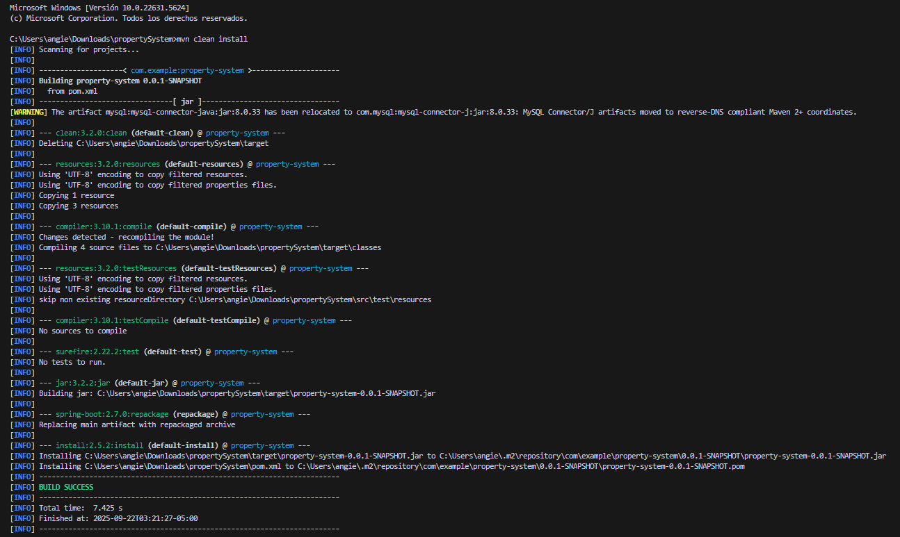
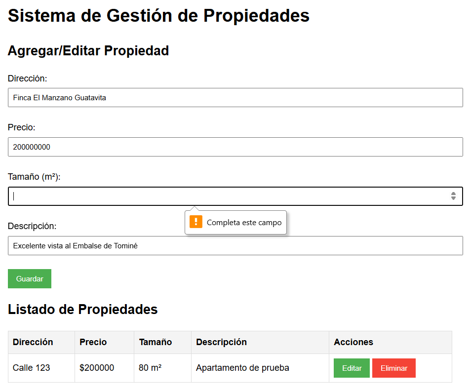

# Sistema de Gestión de Propiedades

Un sistema CRUD completo para la gestión de propiedades inmobiliarias, construido con Spring Boot y desplegado en AWS. Este sistema permite a los usuarios crear, leer, actualizar y eliminar listados de propiedades a través de una interfaz web intuitiva.


## Arquitectura del Sistema

### Diagrama de Componentes
```
[Frontend (Web Estática)]
        ↓
    HTTP/REST
        ↓
[Backend (EC2)] → API Spring Boot
        ↓
    Protocolo MySQL
        ↓
[Base de Datos (RDS)] → Instancia MySQL
```

### Diseño de Clases
```
┌─────────────────┐     ┌──────────────────┐     ┌────────────────┐
│     Property    │     │PropertyController │    │PropertyRepository│
├─────────────────┤     ├──────────────────┤     ├────────────────┤
│ -id: Long       │     │ -repository      │     │ +findAll()     │
│ -address: String│ ←── │ +getAll()        │ ←── │ +findById()    │
│ -price: Double  │     │ +getById()       │     │ +save()        │
│ -size: Double   │     │ +create()        │     │ +delete()      │
│ -description: String│ │ +update()        │     └────────────────┘
└─────────────────┘     │ +delete()        │
                        └──────────────────┘
```

## Comenzando

Estas instrucciones te permitirán obtener una copia del proyecto en funcionamiento en tu máquina local para propósitos de desarrollo y pruebas.

### Prerrequisitos

* Java 11 o superior
* Maven 3.6+
* MySQL 8.0
* Cuenta AWS con permisos para:
  - EC2
  - RDS
  - Grupos de Seguridad
* AWS CLI instalado y configurado

### Local Development Setup

1. Clone the repository:
```bash
git clone https://github.com/AngieRamosCortes/Propery-System-AREP.git
```

2. Configura la base de datos MySQL:
   * Asegúrate de que MySQL esté corriendo en el puerto 3306 Ingresando usuario y contraseña
   * Si necesitas usar otras credenciales, modifica el archivo `src/main/resources/application.properties`

3. Navega hasta el directorio del proyecto:
```bash
cd propertySystem
```

4. Compila el proyecto con Maven:
```bash
mvn clean install
```


5. Ejecuta la aplicación:
```bash
mvn spring-boot:run
```


6. Abre tu navegador y visita:
```
http://localhost:8080
```

## Estructura del Proyecto

```
src/
├── main/
│   ├── java/
│   │   └── com/
│   │       └── example/
│   │           └── propertysystem/
│   │               ├── PropertySystemApplication.java
│   │               ├── controller/
│   │               │   └── PropertyController.java
│   │               ├── model/
│   │               │   └── Property.java
│   │               └── repository/
│   │                   └── PropertyRepository.java
│   └── resources/
│       ├── application.properties
│       ├── schema.sql
│       └── static/
│           ├── index.html
│           └── app.js
```

## API Documentation

## Endpoints de la API 

* GET `/api/properties` - Obtener todas las propiedades
* GET `/api/properties/{id}` - Obtener una propiedad por ID
* POST `/api/properties` - Crear una nueva propiedad
* PUT `/api/properties/{id}` - Actualizar una propiedad existente
* DELETE `/api/properties/{id}` - Eliminar una propiedad

### Ejemplo de Objeto Property

```json
{
    "address": "Calle 123 #45-67",
    "price": 250000000,
    "size": 120,
    "description": "Casa de 3 habitaciones con jardín"
}
```

## Instrucciones de Despliegue en AWS

### 1. Configuración de la Base de Datos (RDS)

1. Crear instancia RDS:
```bash
aws rds create-db-instance \
    --db-instance-identifier property-db \
    --db-instance-class db.t2.micro \
    --engine mysql \
    --master-username admin \
    --master-user-password rootroot \
    --allocated-storage 20
```

2. Configurar Grupo de Seguridad RDS:
```bash
aws ec2 create-security-group \
    --group-name rds-sg \
    --description "Grupo de Seguridad para RDS"

aws ec2 authorize-security-group-ingress \
    --group-name rds-sg \
    --protocol tcp \
    --port 3306 \
    --cidr 0.0.0.0/0
```


### 2. Despliegue del Backend (EC2)

1. Crear instancia EC2:
```bash
aws ec2 run-instances \
    --image-id ami-0c55b159cbfafe1f0 \
    --instance-type t2.micro \
    --key-name property-key \
    --security-groups backend-sg
```

2. Configurar Grupo de Seguridad EC2:
```bash
aws ec2 create-security-group \
    --group-name backend-sg \
    --description "Grupo de Seguridad para Backend"

aws ec2 authorize-security-group-ingress \
    --group-name backend-sg \
    --protocol tcp \
    --port 8080 \
    --cidr 0.0.0.0/0
```

3. Desplegar aplicación:
```bash
# Conectar a la instancia EC2
ssh -i C:\Users\angie\Downloads\Keyproperty-system-backend.pem ec2-user@ec2-34-230-70-39.compute-1.amazonaws.com


# Ingresamos al DNS público de la instancia
http://ec2-34-230-70-39.compute-1.amazonaws.com:8080/
```


## Capturas de Pantalla Funcionalidades

### Lista de Propiedades


### Formulario de Agregar Propiedad


### Editar Propiedad


### Eliminar Propiedad


### Actualizar Propiedad


### Validaciones de campos obligatorios
Si algún campo no se llena no se puede agregar una propiedad




Nota: descargamos también MySQL en nuestro PC y con podemos acceder a localhost:8080


### Resumen

Frontend Requirements ✅

1. User Interface
- ✅ Forms for property information in index.html
- ✅ List view with CRUD options
- ✅ Client-side validation (HTML5 required attributes)
- ✅ Fetch API usage in app.js

Backend Requirements ✅

1. REST Endpoints in PropertyController.java

- ✅ POST /api/properties
- ✅ GET /api/properties and /api/properties/{id}
- ✅ PUT /api/properties/{id}
- ✅ DELETE /api/properties/{id}
- ✅ Error handling implemented

2. Property Model

- ✅ ID (auto-generated)
- ✅ Address
- ✅ Price
- ✅ Size
- ✅ Description

Database Requirements ✅

1. MySQL Configuration
- ✅ Table structure in schema.sql
- ✅ JPA/Hibernate mapping
- ✅ CRUD persistence operations

AWS Deployment ✅

- ✅ Backend deployed on EC2
- ✅ Database deployed on RDS
- ✅ Services properly separated

- ✅ Screenshots

README.md Content ✅

- ✅ Project Summary
- ✅ System Architecture
- ✅ Class Design
- ✅ AWS Deployment Instructions
- ✅ Screenshots

Video: A short video demonstrating the system running, including examples of create, read, update, and delete operations. The video should show how to deploy the system ✅


## Construido Con

* [Spring Boot](https://spring.io/projects/spring-boot) - Framework Backend
* [Maven](https://maven.apache.org/) - Gestión de Dependencias
* [MySQL](https://www.mysql.com/) - Base de Datos
* [AWS](https://aws.amazon.com/) - Plataforma en la Nube
  - EC2 para Backend
  - RDS para Base de Datos

## Autora

* **Angie Julieth Ramos Cortes** - *Desarrollo Completo* - [AngieRamosCortes](https://github.com/AngieRamosCortes)

## Licencia

Este proyecto está bajo la Licencia MIT - ver el archivo [LICENSE.md](LICENSE.md) para más detalles.

## Agradecimientos

* Al profesor del curso de Arquitecturas Empresariales por su guía
* Documentación de Spring Boot y AWS
* Comunidad de Stack Overflow por su valiosa ayuda
